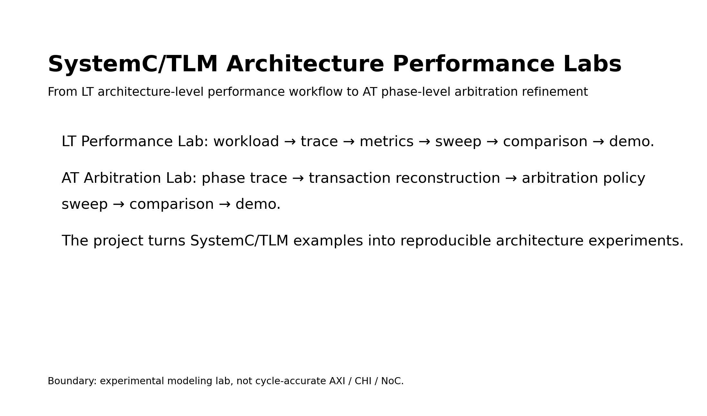
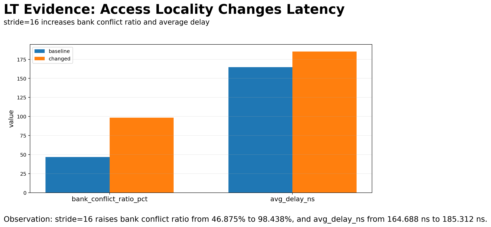
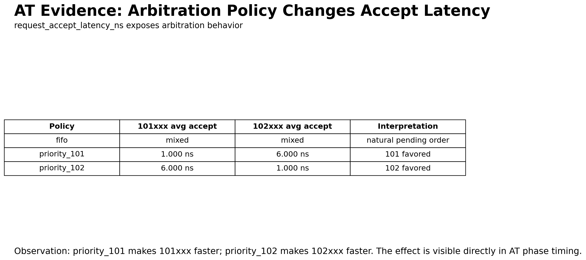
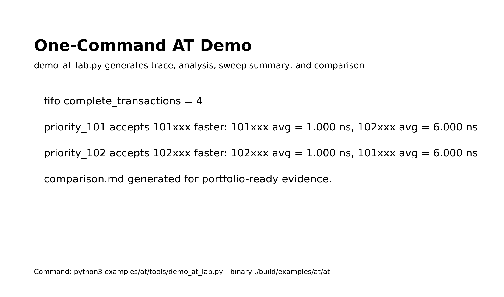

# SystemC/TLM Architecture Performance Labs

One-line summary: a SystemC/TLM virtual platform performance modeling lab that
turns architecture workloads into reproducible traces, metrics, sweeps,
comparisons, and demos.

Core experiment chain:

```text
workload → trace → metrics → sweep → comparison → demo
```

This page is intended for SoC Architecture Engineers, Performance Modeling
Engineers, ESL Engineers, and hiring managers reviewing practical modeling
evidence. The project does not claim cycle accuracy, AXI compliance, CHI
compliance, or NoC protocol completeness.

## Why LT and AT

The LT lab establishes the architecture-level performance workflow: workload
knobs, trace instrumentation, latency decomposition, generated metrics, sweep
automation, and comparison reports.

The AT lab adds phase-level timing refinement around the TLM-2.0 base protocol:
`BEGIN_REQ`, `END_REQ`, `BEGIN_RESP`, and `END_RESP`. It makes arbitration
effects visible without presenting the model as a production interconnect or a
cycle-accurate hardware implementation.

Together, the two labs show a staged path from architecture exploration to
phase-level timing observability.

## LT Performance Lab

`examples/lt` focuses on latency decomposition and workload sensitivity. It
instruments LT transactions and reports:

- `queue_delay_ns`
- `target_service_delay_ns`
- `bank_conflict_delay_ns`
- workload sweep output in `summary.csv`
- generated comparison output in `comparison.md`
- one-command demo behavior

Key result: `stride=16` raises `bank_conflict_ratio_pct` from `46.875%` to
`98.438%`, while `avg_delay_ns` rises from `164.688 ns` to `185.312 ns`.

## AT Arbitration Lab

`examples/at` focuses on AT phase trace visibility and arbitration policy
effects. It records a trace schema with `txn_id`, `direction`, phase, command,
address, data, delay, timestamp, and `response_status`.

The AT lab includes:

- `analyze_phase_trace.py`
- dual initiator arbitration
- arbitration policies: `fifo`, `priority_101`, `priority_102`
- `run_arbitration_sweep.py`
- `demo_at_lab.py`
- generated `summary.csv`
- generated `comparison.md`

Reproduce the AT demo:

```bash
python3 examples/at/tools/demo_at_lab.py --binary ./build/examples/at/at
```

Key result for `priority_101`: it accepts `101xxx` faster:

- `101xxx avg = 1.000 ns`
- `102xxx avg = 6.000 ns`

Key result for `priority_102`: it accepts `102xxx` faster:

- `102xxx avg = 1.000 ns`
- `101xxx avg = 6.000 ns`

## Evidence Cards

### 1. Project Map



This card proves the project is organized around two main labs,
`examples/lt` and `examples/at`, and that both contribute to the same
workload-to-demo experiment chain.

### 2. LT Stride-16 Bank Conflict Result



This card proves that the LT workflow can expose workload-sensitive latency
behavior. The `stride=16` case increases bank conflicts and raises average
delay, turning a workload knob into measured performance evidence.

### 3. AT Policy Latency Result



This card proves that the AT arbitration policy knob changes observable
request-accept latency. `priority_101` favors `101xxx` transactions, while
`priority_102` favors `102xxx` transactions.

### 4. AT Demo Key Conclusions



This card proves the demo path is reproducible from the command line and
connects the AT binary, phase trace analyzer, arbitration sweep, generated
summary, and generated comparison report.

## Attribution Boundary

`references/doulos_at_example` is external reference material for studying the
Doulos AT example structure and TLM-2.0 AT phase-level coding patterns. It is
not presented as a project deliverable, not treated as the `examples/at`
mainline implementation, and not used as evidence for this portfolio page.
